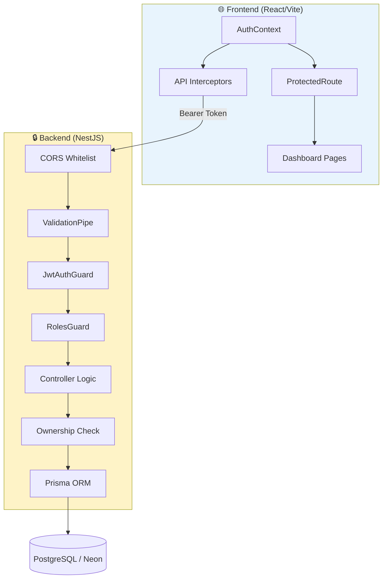
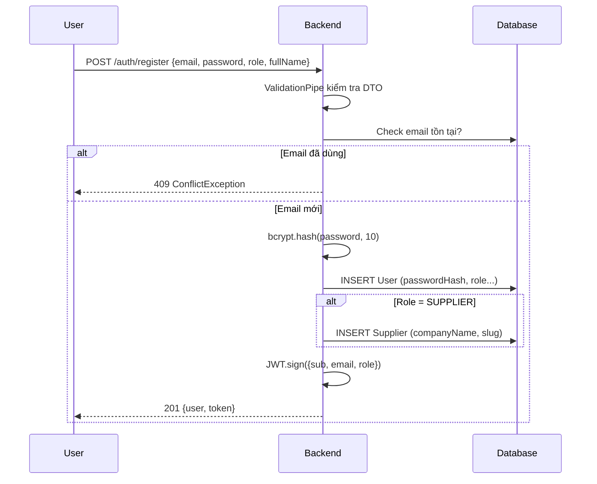
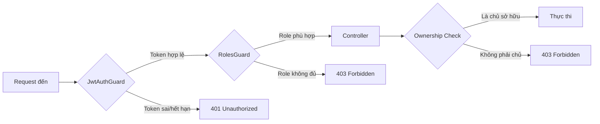
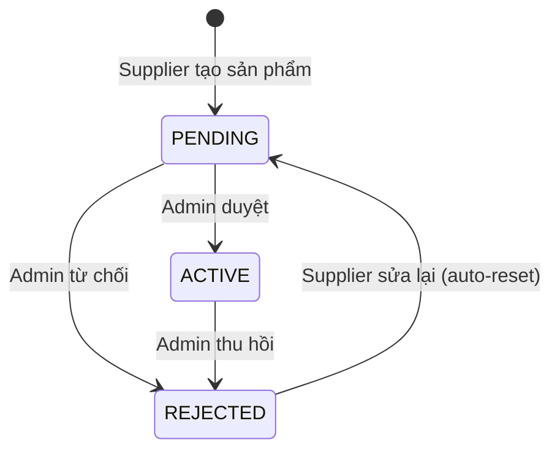

# 🔐 MIVN5 — Tài Liệu Cơ Chế Bảo Mật Hệ Thống

> **Phiên bản:** 1.0 | **Ngày cập nhật:** 12/04/2026  
> **Nền tảng:** VIEproduct B2B Platform  
> **Stack:** NestJS (Backend) + React/Vite (Frontend) + PostgreSQL (Neon) + Prisma ORM

---

## 📋 Mục Lục

1. [Tổng quan kiến trúc bảo mật](#1-tổng-quan-kiến-trúc-bảo-mật)
2. [Xác thực (Authentication)](#2-xác-thực-authentication)
3. [Phân quyền (Authorization — RBAC)](#3-phân-quyền-authorization--rbac)
4. [Bảo vệ API (Backend Security)](#4-bảo-vệ-api-backend-security)
5. [Bảo vệ Frontend (Client-Side Security)](#5-bảo-vệ-frontend-client-side-security)
6. [Bảo vệ Dữ liệu (Data Security)](#6-bảo-vệ-dữ-liệu-data-security)
7. [Quy trình duyệt nội dung (Content Moderation)](#7-quy-trình-duyệt-nội-dung-content-moderation)
8. [Upload & File Security](#8-upload--file-security)
9. [Bản đồ quyền truy cập API](#9-bản-đồ-quyền-truy-cập-api)
10. [Hạn chế & Khuyến nghị nâng cấp](#10-hạn-chế--khuyến-nghị-nâng-cấp)

---

## 1. Tổng Quan Kiến Trúc Bảo Mật



Hệ thống bảo mật MIVN5 hoạt động theo mô hình **Defense in Depth** (phòng thủ nhiều lớp):

| Lớp | Vị trí | Cơ chế |
|-----|--------|--------|
| **Lớp 1** | Frontend | `ProtectedRoute` + RBAC routing |
| **Lớp 2** | Network | CORS Whitelist |
| **Lớp 3** | API Gateway | `ValidationPipe` (whitelist + transform) |
| **Lớp 4** | Authentication | `JwtAuthGuard` (Passport JWT) |
| **Lớp 5** | Authorization | `RolesGuard` + `@Roles()` decorator |
| **Lớp 6** | Business Logic | Ownership verification (supplierId check) |
| **Lớp 7** | Database | Prisma ORM (parameterized queries, no SQL injection) |

---

## 2. Xác Thực (Authentication)

### 2.1 Đăng ký (`POST /api/v1/auth/register`)



**Chi tiết kỹ thuật:**

| Thuộc tính | Giá trị |
|-----------|---------|
| **Thuật toán hash** | `bcrypt` với salt rounds = 10 |
| **JWT Algorithm** | HS256 (HMAC-SHA256) |
| **JWT Secret** | Đọc từ `JWT_SECRET` env, fallback: `mivn5-secret-key-2026` |
| **Token Expiry** | 7 ngày (`expiresIn: '7d'`) |
| **JWT Payload** | `{ sub: userId, email, role }` |
| **Password min length** | 6 ký tự (validated bởi `class-validator`) |

### 2.2 Đăng nhập (`POST /api/v1/auth/login`)

- Tìm user bằng email → so sánh password bằng `bcrypt.compare()`
- **Không tiết lộ thông tin**: Cả email sai và password sai đều trả ra cùng message `"Email hoặc mật khẩu không đúng"` → không cho attacker biết email nào tồn tại
- `passwordHash` **không bao giờ** được trả về client (bị loại bỏ bằng destructuring)

### 2.3 Đổi mật khẩu (`PUT /api/v1/auth/password/:id`)

- Yêu cầu nhập mật khẩu cũ + mật khẩu mới
- Chỉ cho phép đổi mật khẩu **của chính mình** (`currentUser.id !== id` → 403)
- Mật khẩu mới được hash lại bằng bcrypt trước khi lưu

---

## 3. Phân Quyền (Authorization — RBAC)

### 3.1 Mô hình vai trò

Hệ thống có **3 vai trò** (Role), định nghĩa bởi Prisma Enum:

```
enum Role {
  BUYER      // Người mua
  SUPPLIER   // Nhà cung cấp
  ADMIN      // Quản trị viên
}
```

### 3.2 Cơ chế hoạt động (Backend)



**Triển khai bằng Custom Decorators + Guards:**

```typescript
// Decorator khai báo vai trò yêu cầu
@Roles('SUPPLIER', 'ADMIN')

// Guard stack: JWT trước, Role sau
@UseGuards(JwtAuthGuard, RolesGuard)
```

### 3.3 Ma trận quyền chi tiết

| Hành động | BUYER | SUPPLIER | ADMIN |
|-----------|:-----:|:--------:|:-----:|
| Xem sản phẩm công khai | ✅ | ✅ | ✅ |
| Tạo sản phẩm | ❌ | ✅ | ❌ |
| Sửa sản phẩm (của mình) | ❌ | ✅ | ✅ (tất cả) |
| Xóa sản phẩm (của mình) | ❌ | ✅ | ✅ (tất cả) |
| Xem sản phẩm mọi trạng thái | ❌ | ❌ | ✅ |
| Duyệt/Từ chối sản phẩm | ❌ | ❌ | ✅ |
| Xem profile người khác | ❌ | ❌ | ✅ |
| Sửa profile (của mình) | ✅ | ✅ | ✅ (tất cả) |
| Upload ảnh | ✅ | ✅ | ✅ |
| Gửi RFQ | ✅ | ❌ | ❌ |
| Phản hồi RFQ | ❌ | ✅ | ❌ |

---

## 4. Bảo Vệ API (Backend Security)

### 4.1 CORS (Cross-Origin Resource Sharing)

Chỉ cho phép request từ các domain được whitelist:

```typescript
app.enableCors({
  origin: [
    'http://localhost:3000',       // Dev frontend
    'http://localhost:5173',       // Vite dev
    'https://vieproduct.com.vn',   // Production
    'https://www.vieproduct.com.vn',
    'https://made-in-viet-nam.vercel.app', // Vercel deployment
  ],
  methods: ['GET', 'POST', 'PUT', 'PATCH', 'DELETE'],
  credentials: true,
});
```

> **Ý nghĩa:** Ngăn chặn website lạ gọi API của hệ thống (chống CSRF từ domain khác).

### 4.2 Global Validation Pipe

```typescript
app.useGlobalPipes(new ValidationPipe({
  whitelist: true,           // Loại bỏ field không khai báo trong DTO
  transform: true,           // Tự động chuyển đổi kiểu dữ liệu
  forbidNonWhitelisted: true, // Reject nếu có field lạ → 400 Bad Request
}));
```

| Cơ chế | Tác dụng |
|--------|----------|
| `whitelist: true` | Tự động strip field không có trong DTO → ngăn **mass assignment** |
| `forbidNonWhitelisted: true` | Reject request nếu gửi field không hợp lệ |
| `transform: true` | Tự chuyển đổi `string → number`, `string → enum` |
| `class-validator` decorators | `@IsEmail()`, `@MinLength(6)`, `@IsEnum(Role)` v.v. |

### 4.3 Chống SQL Injection

- **Prisma ORM** sử dụng **parameterized queries** tự động → không thể inject SQL
- Không có raw SQL query nào trong codebase

### 4.4 Ownership Verification (Business Logic Layer)

Ngoài việc kiểm tra role, hệ thống còn kiểm tra **quyền sở hữu** ở tầng controller:

```typescript
// Ví dụ: Supplier chỉ sửa/xóa sản phẩm CỦA MÌNH
async update(@Param('id') id, @Body() dto, @CurrentUser() currentUser) {
  if (currentUser.role === 'ADMIN') {
    return this.productsService.update(id, null, dto); // Admin bypass
  }
  const supplier = await this.prisma.supplier.findUnique({
    where: { userId: currentUser.id },
  });
  return this.productsService.update(id, supplier.id, dto); // Check ownership
}
```

**Các endpoint có Ownership Check:**
- `PUT /products/:id` — Supplier chỉ sửa sản phẩm của mình
- `DELETE /products/:id` — Supplier chỉ xóa sản phẩm của mình
- `GET /products/me` — Chỉ trả sản phẩm của supplier đang đăng nhập
- `GET /auth/profile/:id` — Chỉ xem profile của chính mình (trừ Admin)
- `PUT /auth/profile/:id` — Chỉ sửa profile của chính mình (trừ Admin)
- `PUT /auth/password/:id` — Chỉ đổi mật khẩu của chính mình

---

## 5. Bảo Vệ Frontend (Client-Side Security)

### 5.1 ProtectedRoute Component

```typescript
// File: frontend/src/components/ProtectedRoute.tsx
export function ProtectedRoute({ children }) {
  const { user, isAuthenticated } = useAuth();

  // Chưa đăng nhập → redirect /login
  if (!isAuthenticated || !user) {
    return <Navigate to="/login" state={{ from: location }} replace />;
  }

  // RBAC: Buyer không vào /dashboard/admin
  if (location.pathname.startsWith('/dashboard/admin') && userRole !== 'admin') {
    return <Navigate to={`/dashboard/${userRole}`} replace />;
  }

  // RBAC: Supplier không vào /dashboard/buyer
  if (location.pathname.startsWith('/dashboard/buyer') && userRole !== 'buyer') {
    return <Navigate to={`/dashboard/${userRole}`} replace />;
  }

  // ... tương tự cho các role khác
}
```

### 5.2 API Interceptors

```typescript
// File: frontend/src/lib/api.ts

// REQUEST: Tự động gắn JWT Token vào mọi request
api.interceptors.request.use((config) => {
  const token = localStorage.getItem('mivn5_token');
  if (token) config.headers.Authorization = `Bearer ${token}`;
  return config;
});

// RESPONSE: Auto-logout khi 401
api.interceptors.response.use(
  (response) => response,
  (error) => {
    if (error.response?.status === 401) {
      // Tránh redirect loop ở trang login/register
      if (currentPath !== '/login' && currentPath !== '/register') {
        localStorage.removeItem('mivn5_token');
        localStorage.removeItem('mivn5_user');
        window.location.href = '/login';
      }
    }
  }
);
```

### 5.3 Token Storage

| Key | Nơi lưu | Nội dung |
|-----|---------|----------|
| `mivn5_token` | `localStorage` | JWT Token (chuỗi) |
| `mivn5_user` | `localStorage` | User object (JSON) |

---

## 6. Bảo Vệ Dữ Liệu (Data Security)

### 6.1 Password Hashing

```
Plaintext → bcrypt.hash(password, 10) → $2b$10$xxxxx...
```

- **Thuật toán:** bcrypt (adaptive hash function)
- **Salt rounds:** 10 (tự động sinh salt)
- **Password không bao giờ lưu dạng plain text**

### 6.2 Sensitive Data Exclusion

- `passwordHash` bị loại khỏi response bằng destructuring: `const { passwordHash, ...userData } = user`
- `select` clause trong Prisma chỉ trả về các field cần thiết

### 6.3 API Data Filtering

```typescript
// GET /products (public) → Luôn ép status = ACTIVE
findAll(@Query() query: ProductQueryDto) {
  return this.productsService.findAll({ ...query, status: 'ACTIVE' });
}
```

> **Ý nghĩa:** Dù attacker cố gắng gửi `?status=PENDING` qua URL, server sẽ **ghi đè** thành `ACTIVE` → không thể xem sản phẩm chưa duyệt qua API công khai.

---

## 7. Quy Trình Duyệt Nội Dung (Content Moderation)



| Trạng thái | Hiển thị công khai? | Ai có thể thấy? |
|-----------|:---:|------|
| `PENDING` | ❌ | Supplier (chủ sở hữu) + Admin |
| `ACTIVE` | ✅ | Tất cả mọi người |
| `REJECTED` | ❌ | Supplier (chủ sở hữu) + Admin |

**API Endpoints liên quan:**
- `PUT /products/:id/verify` — Admin Only — Body: `{ status: 'ACTIVE' | 'REJECTED' }`
- `GET /products/admin` — Admin Only — Lấy tất cả sản phẩm mọi trạng thái
- `GET /products/me` — Supplier Only — Lấy sản phẩm của mình (mọi trạng thái)
- `GET /products` — Public — **Chỉ trả ACTIVE**

---

## 8. Upload & File Security

### 8.1 Endpoint: `POST /api/v1/uploads`

| Thuộc tính | Giá trị |
|-----------|---------|
| **Xác thực** | `@UseGuards(JwtAuthGuard)` — phải đăng nhập |
| **File types** | Chỉ JPG, JPEG, PNG, GIF, WEBP |
| **Max file size** | 5MB (5 × 1024 × 1024 bytes) |
| **Tên file** | UUID v4 + extension gốc → chống trùng, chống path traversal |
| **Thư mục lưu** | `backend/uploads/` |
| **Serving** | `@nestjs/serve-static` tại `/uploads/` |

### 8.2 File Validation

```typescript
const imageFileFilter = (_req, file, cb) => {
  if (!file.mimetype.match(/\/(jpg|jpeg|png|gif|webp)$/)) {
    return cb(new BadRequestException('Chỉ chấp nhận file ảnh'), false);
  }
  cb(null, true);
};
```

---

## 9. Bản Đồ Quyền Truy Cập API

### 🟢 Public (Không cần đăng nhập)

| Method | Endpoint | Mô tả |
|--------|----------|-------|
| POST | `/auth/register` | Đăng ký |
| POST | `/auth/login` | Đăng nhập |
| GET | `/products` | Danh sách sản phẩm (chỉ ACTIVE) |
| GET | `/products/:slug` | Chi tiết sản phẩm |
| GET | `/products/:id/related` | Sản phẩm liên quan |
| GET | `/categories` | Danh mục |
| GET | `/suppliers` | Danh sách NCC |
| GET | `/suppliers/:slug` | Chi tiết NCC |
| POST | `/contact` | Gửi liên hệ |

### 🔵 Authenticated (Cần đăng nhập — bất kì role)

| Method | Endpoint | Mô tả |
|--------|----------|-------|
| GET | `/auth/profile/:id` | Xem profile (chỉ của mình, trừ Admin) |
| PUT | `/auth/profile/:id` | Sửa profile (chỉ của mình, trừ Admin) |
| PUT | `/auth/password/:id` | Đổi mật khẩu (chỉ của mình) |
| POST | `/uploads` | Upload ảnh |

### 🟡 SUPPLIER Only

| Method | Endpoint | Mô tả |
|--------|----------|-------|
| GET | `/products/me` | Sản phẩm của tôi (mọi trạng thái) |
| POST | `/products` | Tạo sản phẩm mới (auto PENDING) |

### 🟠 SUPPLIER + ADMIN

| Method | Endpoint | Mô tả |
|--------|----------|-------|
| PUT | `/products/:id` | Sửa sản phẩm (ownership check) |
| DELETE | `/products/:id` | Xóa sản phẩm (ownership check) |

### 🔴 ADMIN Only

| Method | Endpoint | Mô tả |
|--------|----------|-------|
| GET | `/products/admin` | Tất cả sản phẩm (mọi trạng thái) |
| PUT | `/products/:id/verify` | Duyệt/Từ chối sản phẩm |
| GET | `/users` | Danh sách người dùng |
| GET | `/contact` | Xem liên hệ |
| GET | `/reports` | Báo cáo |

---

## 10. Hạn Chế & Khuyến Nghị Nâng Cấp

### ⚠️ Hạn chế hiện tại

| # | Hạn chế | Mức rủi ro | Khuyến nghị |
|---|---------|:----------:|-------------|
| 1 | JWT Secret có fallback hardcode | 🔴 Cao | Bắt buộc set `JWT_SECRET` env, bỏ fallback |
| 2 | Token lưu trong localStorage | 🟡 Trung bình | Chuyển sang httpOnly cookie để chống XSS |
| 3 | Không có Rate Limiting | 🟡 Trung bình | Thêm `@nestjs/throttler` chống brute-force |
| 4 | Không có Refresh Token | 🟡 Trung bình | Triển khai Refresh Token rotation |
| 5 | Upload lưu local disk | 🟡 Trung bình | Chuyển sang cloud storage (S3, Cloudinary) |
| 6 | Không có CSRF protection | 🟢 Thấp | Đã giảm thiểu bằng CORS + Bearer Token |
| 7 | Không có audit log | 🟢 Thấp | Thêm logging cho các hành động nhạy cảm |
| 8 | Không có 2FA | 🟢 Thấp | Thêm TOTP cho Admin accounts |

### ✅ Điểm mạnh hiện tại

- ✅ Password hashing bằng bcrypt (industry standard)
- ✅ JWT với expiration (7 ngày)
- ✅ RBAC đa lớp (Frontend route guard + Backend guard)
- ✅ Ownership verification ở tầng business logic
- ✅ Input validation toàn diện (class-validator + whitelist DTO)
- ✅ SQL injection prevention (Prisma parameterized queries)
- ✅ CORS whitelist nghiêm ngặt
- ✅ Content moderation workflow (PENDING → ACTIVE/REJECTED)
- ✅ File upload validation (type + size)
- ✅ Sensitive data exclusion (passwordHash never exposed)
- ✅ Auto-logout khi token hết hạn (frontend interceptor)

---

> **📝 Ghi chú:** Tài liệu này phản ánh trạng thái bảo mật tính đến ngày 12/04/2026. Mọi thay đổi sau ngày này cần được cập nhật tương ứng.
